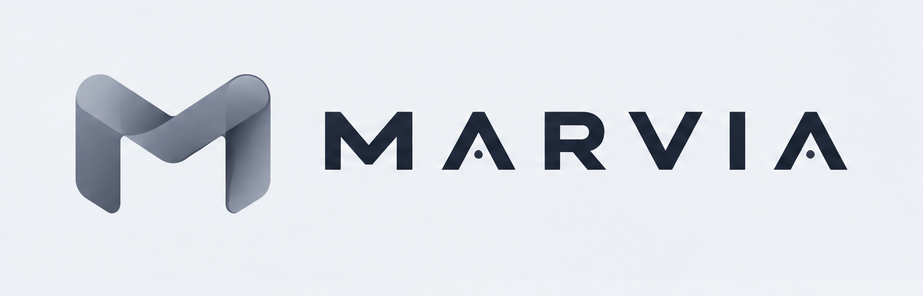
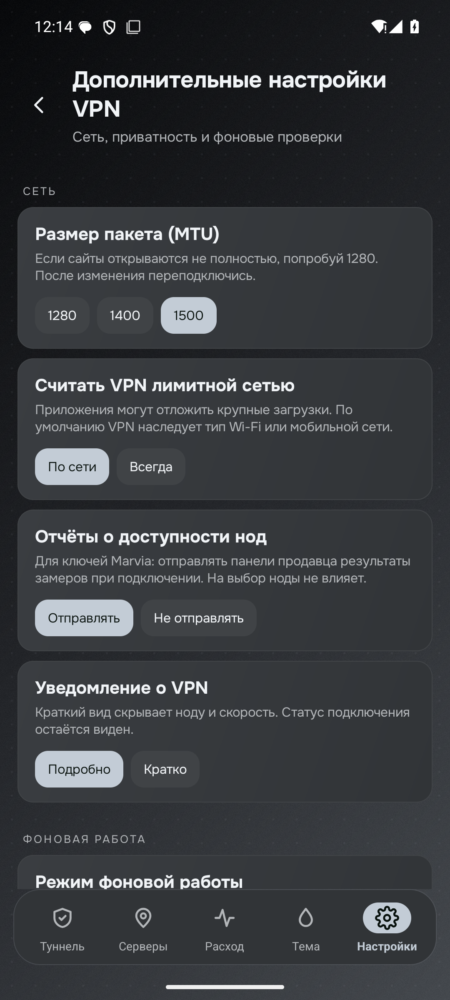
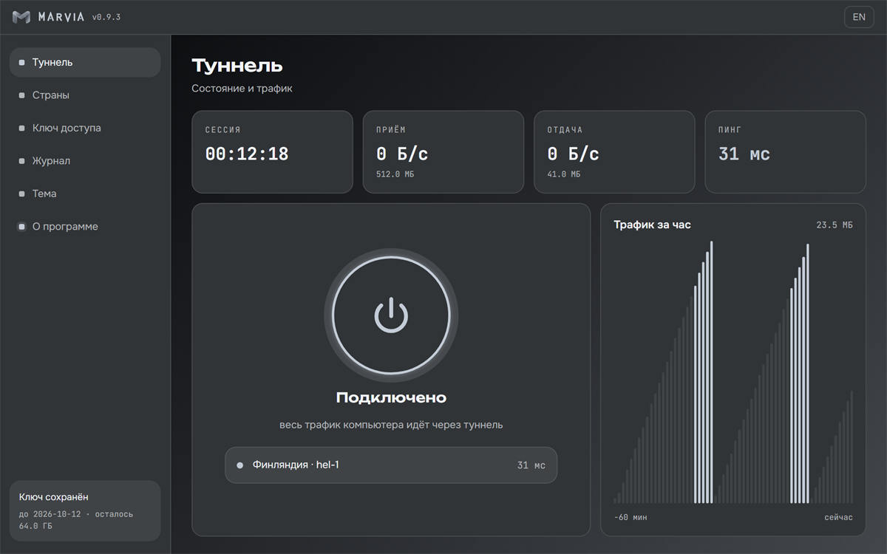
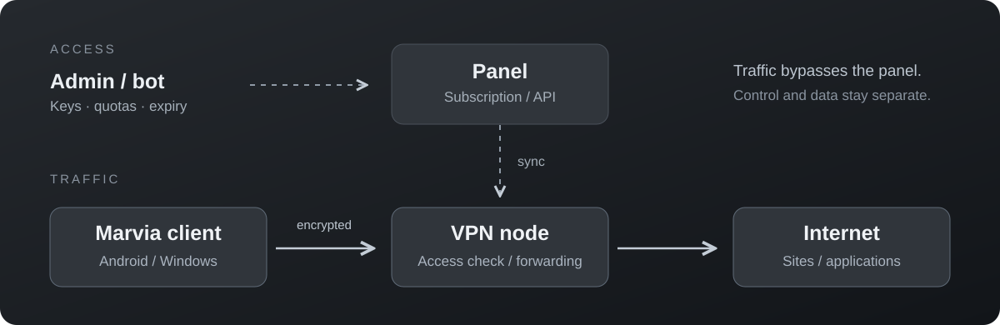
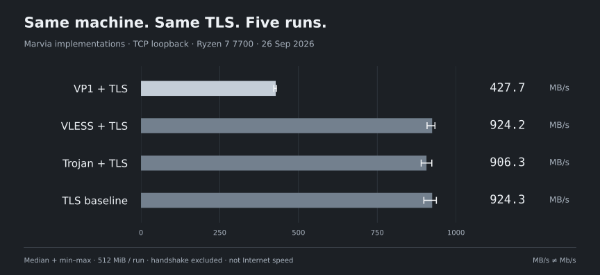

<div align="center">



**VPN for Android and Windows. Panel, nodes and the VP1 protocol.**

[Русский](README.md) · [English](README.en.md) · [简体中文](README.zh-CN.md)

[](https://github.com/jytt8u/marvia/releases/latest/download/marvia-android.apk)
[](https://github.com/jytt8u/marvia/releases/latest/download/marvia-windows.exe)
[](#install-the-panel)
[](docs/guide.md)

[Releases](https://github.com/jytt8u/marvia/releases) · [CI](https://github.com/jytt8u/marvia/actions) · [Privacy](docs/privacy.md)

</div>

## The app

Android 0.12.2 · actual emulator captures · no key added

| Home | VPN settings | Network and privacy |
|:---:|:---:|:---:|
|  |  |  |

<details>
<summary>Windows and panel — archived captures</summary>

Windows 0.9.3 and a local panel instance. Android above is the current 0.12.2 release.




</details>

## Architecture



The panel grants access; VPN packets pass through a node, not the panel.
[Trust boundaries](docs/architecture.md).

## Benchmark



**Unreleased optimization: VP1 435 → 678 MB/s (+56%).** Five paired runs of the old and new builds; encryption and wire compatibility are unchanged. [Before/after data](docs/benchmarks/2026-09-26-record-fit/README.md).

**VP1, VLESS and Trojan on one PC, with the same TLS 1.3.**
Five interleaved 512 MiB runs; Ryzen 7 7700, Windows, Go 1.26.6.
This measures Marvia implementations over loopback, without Internet or TUN.
VP1 adds Noise and framing; it is slower in this test.

[Method, ranges and raw data](docs/performance.md) · [Benchmark source](cmd/marvia-bench)

An earlier Internet test measured **83 Mb/s via VP1 vs 86 directly**.
That single observation is separate from these local MB/s measurements.

## Protocols

WireGuard and OpenVPN tunnel IP packets; the others below are proxies. On
Android, Marvia also creates a system VPN interface for third-party proxy keys.

| Protocol | Transport and distinction | Marvia support |
|---|---|---|
| **[VP1](docs/protocol.md)** | Noise proxy over TLS/REALITY, WebSocket or QUIC; falls back to TCP if QUIC/UDP is unavailable | First-party node, Android and Windows |
| [WireGuard](https://www.wireguard.com/protocol/) | IP tunnel over UDP; no built-in HTTPS disguise | Android: third-party key |
| [OpenVPN](https://openvpn.net/community-docs/community-articles/openvpn-2-7-manual.html) | IP tunnel over UDP or TCP with TLS; a separate protocol, not ordinary HTTPS | Not integrated |
| [VLESS + REALITY](https://xtls.github.io/en/config/transports/reality.html) | TCP proxy with TLS handshake disguised as a target site | Node and Android |
| [Trojan](https://github.com/trojan-gfw/trojan/blob/master/docs/protocol.md) | Proxy inside TLS with a cover site | Node and Android |
| [Shadowsocks](https://shadowsocks.org/doc/what-is-shadowsocks.html) | Encrypted TCP/UDP proxy; does not resemble HTTPS on its own | Android: third-party key |
| [Hysteria 2](https://v2.hysteria.network/docs/developers/Protocol/) | QUIC/UDP proxy with HTTP/3 appearance; requires working UDP | Android: third-party key |

WireGuard, OpenVPN, Hysteria 2 and Xray were not run in this benchmark.
VP1 is not compatible with WireGuard or Xray clients.

## What is included

| Client | Server |
|---|---|
| Android: Marvia and third-party keys, node selection, usage and VPN settings | Panel and nodes: limits, accounting, backups and bot API |
| Windows: TUN client | VP1, VLESS and Trojan; verified node updates |

## Compared with other projects

| Project | Focus | Notable capability |
|---|---|---|
| **Marvia** | Panel + nodes + first-party Android/Windows + VP1 | One stack for users and operators |
| [Marzban](https://github.com/Gozargah/Marzban) | Xray panel | Scheduled quotas and Telegram integration |
| [Remnawave](https://docs.rw/) | Xray panel and nodes | Mihomo/sing-box templates, device controls |
| [3x-ui](https://docs.sanaei.dev/docs/) | Xray panel | Broad protocol and administration support |

Marvia still lacks automatic monthly quota resets, buyer migration that keeps
links intact, and Clash/sing-box subscriptions. The linked project documentation
supports the feature comparison; no matched speed ranking is available.

## Get started

> **Have a key?** Download the [Android APK](https://github.com/jytt8u/marvia/releases/latest/download/marvia-android.apk)
> or [Windows client](https://github.com/jytt8u/marvia/releases/latest/download/marvia-windows.exe),
> add a `marvia://…` link in **Servers**, and connect.

Android also accepts VLESS, VMess, Trojan, Shadowsocks, Hysteria2 and WireGuard
links. The app is not yet on Google Play.

### Install the panel

Use a Linux server and a domain with an A record. Download the installer from
the [official release](https://github.com/jytt8u/marvia/releases/latest):

```bash
curl -fsSL https://github.com/jytt8u/marvia/releases/latest/download/install-panel.sh -o install-panel.sh
sh install-panel.sh --domain panel.example.com --email you@example.com
```

Save the admin token displayed during installation, then create a node and a
client in the panel. [Full guide (Russian)](docs/guide.md) · [Bot API](docs/bot.md).

## Still to do

- Google Play: physical-device verification, declarations
  and testing. [Publication plan (Russian)](docs/google-play.md).
- Monthly quota resets and buyer migration with stable links.
- iOS, Clash/sing-box subscriptions, TUIC, Shadowsocks plugins, and per-device
  revocation when a key is shared.
- Before 1.0: stabilize APIs and link formats; validate rollback and staged node updates.

Marvia does not sell VPN access, take payments or host servers. Versions below
1.0 may change APIs and link formats.

## Docs and build

[Guide](docs/guide.md) · [Architecture](docs/architecture.md) ·
[VP1 protocol](docs/protocol.md) · [Privacy](docs/privacy.md) ·
[Changelog](CHANGELOG.md)

Server binaries require Go 1.26.6 or newer:

```bash
go test ./...
go vet ./...
go build -o bin/ ./...
```

Android is built separately with [`scripts/publish-apk.ps1`](scripts/publish-apk.ps1);
the signing key is stored outside this repository.
