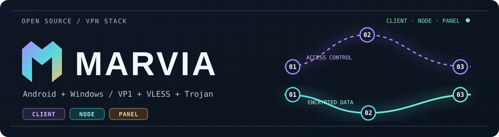
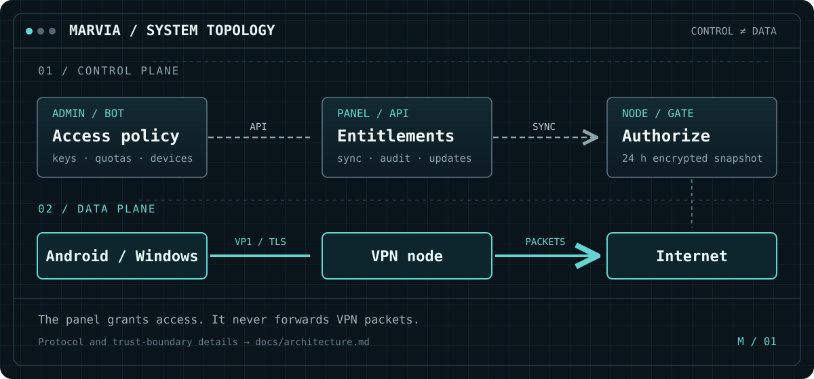
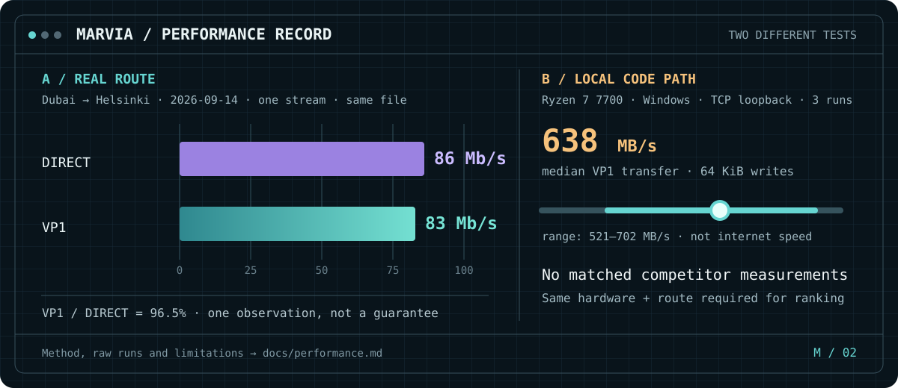

<div align="center">



**VPN для Android и Windows. Свои панель, ноды и протокол VP1.**

[](README.md)
[](README.en.md)
[](README.zh-CN.md)

[](https://github.com/jytt8u/marvia/releases/latest)
[](https://github.com/jytt8u/marvia/actions)

[](https://github.com/jytt8u/marvia/releases/latest/download/marvia-android.apk)
[](https://github.com/jytt8u/marvia/releases/latest/download/marvia-windows.exe)
[](#установка-панели)
[](docs/guide.md)

</div>

## Архитектура



Панель управляет доступом; пакеты идут через ноду без панели.
[Границы доверия](docs/architecture.md).

## Скорость



Один [полевой замер](docs/guide.md): Дубай → Хельсинки, один поток, 14.09.2026.
**83 против 86 Мбит/с** — 96,5% скорости прямого пути. Локальный тест ядра
VP1 на Ryzen 7 7700: медиана **638 МБ/с**, это не скорость интернета.
[Методика и исходные результаты](docs/performance.md). Замеров конкурентов
на том же сервере и маршруте пока нет.

## Что внутри

| Клиент | Сервер |
|---|---|
| Android: свои и чужие ключи, выбор ноды, статистика, настройки VPN | Панель и ноды: лимиты, учёт, резервные копии, API бота |
| Windows: TUN-клиент | VP1, VLESS и Trojan; проверяемое обновление нод |

## Чем отличается от других

| Проект | Основной фокус | Сильная сторона |
|---|---|---|
| **Marvia** | Панель + ноды + свои Android/Windows + VP1 | один комплект для покупателя и владельца |
| [Marzban](https://github.com/Gozargah/Marzban) | Xray-панель | периодические квоты, Telegram-бот; есть отдельный [Nabzram](https://github.com/Gozargah/Nabzram) |
| [Remnawave](https://docs.rw/) | Xray-панель и ноды | шаблоны Mihomo/sing-box, контроль устройств |
| [3x-ui](https://docs.sanaei.dev/docs/) | Xray-панель | широкий выбор протоколов и админ-инструментов |

Marvia пока уступает по автоматическому месячному сбросу квот, импорту клиентов
и форматам Clash/sing-box. Сравнение основано на документации проектов по
ссылкам в таблице; сравнимых замеров скорости конкурентов пока нет.

## Начать

> [!TIP]
> **Получили ключ?** Скачайте [Android APK](https://github.com/jytt8u/marvia/releases/latest/download/marvia-android.apk)
> или [Windows-клиент](https://github.com/jytt8u/marvia/releases/latest/download/marvia-windows.exe),
> добавьте ссылку `marvia://…` во вкладке «Серверы» и подключитесь.

Android также принимает VLESS, VMess, Trojan, Shadowsocks, Hysteria2 и WireGuard.
В Google Play приложения пока нет.

### Установка панели

Нужны Linux-сервер и домен с A-записью. Установщик берётся из
[официального релиза](https://github.com/jytt8u/marvia/releases/latest):

```bash
curl -fsSL https://github.com/jytt8u/marvia/releases/latest/download/install-panel.sh -o install-panel.sh
sh install-panel.sh --domain panel.example.com --email you@example.com
```

Сохраните показанный при установке админский токен. Затем создайте ноду и
клиента в панели. [Полный порядок](docs/guide.md) · [API бота](docs/bot.md).

## Что пока не готово

- Google Play: физическая проверка сборки, политика конфиденциальности в
  приложении, декларации и тестирование. [План публикации](docs/google-play.md).
- Автоматический месячный сброс квоты и импорт покупателей с сохранением ссылок.
- iOS, подписки Clash/sing-box, TUIC, плагины Shadowsocks и раздельный отзыв
  устройств с общим ключом.
- До 1.0: стабилизация API и ссылок, проверка отката и поэтапное обновление нод.

Marvia не продаёт доступ, не принимает платежи и не размещает серверы.
Версия ниже 1.0 означает, что API и форматы могут меняться.

## Документы и сборка

[Руководство](docs/guide.md) ·
[Архитектура](docs/architecture.md) ·
[Протокол VP1](docs/protocol.md) ·
[Конфиденциальность](docs/privacy.md) ·
[История версий](CHANGELOG.md)

Для серверных бинарников нужен Go 1.26.6+:

```bash
go test ./...
go vet ./...
go build -o bin/ ./...
```

Android собирается отдельно через [`scripts/publish-apk.ps1`](scripts/publish-apk.ps1);
ключ подписи хранится вне репозитория.
