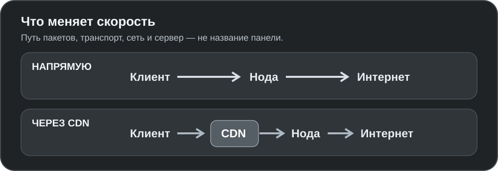

<div align="center">


# Marvia

**VPN для Android и Windows. Свои панель, ноды и протокол VP1.**

[](https://github.com/jytt8u/marvia/releases/latest)
[](https://github.com/jytt8u/marvia/actions)

[**Скачать**](https://github.com/jytt8u/marvia/releases/latest) ·
[**Установить панель**](#установка-панели) ·
[**Документация**](docs/guide.md)

</div>

## В двух словах

| Покупателю | Владельцу сервера |
|---|---|
| Одна ссылка, выбор живой ноды, расход и сессии в приложении | Панель, ноды, лимиты, резервные копии и API для своего бота |
| Android: свои и чужие ключи; Windows: TUN-клиент | VP1 рядом с VLESS и Trojan; проверяемое обновление отдельной службой |

## Экраны

Android **0.12.2**, серый вид, эмулятор без ключей. Данные в предпросмотре темы — макет.

<table>
<tr>
<td align="center" width="33%"><br><sub>Туннель</sub></td>
<td align="center" width="33%"><br><sub>Настройки VPN</sub></td>
<td align="center" width="33%"><br><sub>Тема</sub></td>
</tr>
</table>

<div align="center">
<br>
<sub>Панель: демонстрационные клиенты, сроки, устройства и трафик</sub>
</div>

## Как это работает


Панель выдаёт права, но не передаёт пакеты. Нода может пережить краткую
недоступность панели с зашифрованным снимком доступа до 24 часов.
[Архитектура и границы доверия](docs/architecture.md).

## Скорость: сравниваем путь, а не вывеску панели



| Сценарий | Путь трафика | Что влияет на результат |
|---|---|---|
| **Marvia VP1 напрямую** | клиент → нода | сеть, CPU, реализация VP1 |
| **Marvia VLESS / Trojan напрямую** | клиент → нода | протокол, TLS и транспорт |
| **Marzban / Remnawave / 3x-ui с Xray напрямую** | клиент → Xray-нода | те же сервер, сеть и настройки транспорта |
| **Через CDN** | клиент → CDN → нода | дополнительный участок; доступность может стать лучше, задержка — другой |

Во всех строках панель **вне пути пакетов**. Сопоставимых замеров на одинаковом
сервере и сети пока нет, поэтому рейтинга в Мбит/с здесь нет.

## Чем отличается от других

| Проект | Основной фокус | Сильная сторона |
|---|---|---|
| **Marvia** | Панель + ноды + свои Android/Windows + VP1 | один комплект для покупателя и владельца |
| [Marzban](https://github.com/Gozargah/Marzban) | Xray-панель | периодические квоты, Telegram-бот; есть отдельный [Nabzram](https://github.com/Gozargah/Nabzram) |
| [Remnawave](https://docs.rw/) | Xray-панель и ноды | шаблоны Mihomo/sing-box, контроль устройств |
| [3x-ui](https://docs.sanaei.dev/docs/) | Xray-панель | широкий выбор протоколов и админ-инструментов |

Marvia пока уступает по автоматическому месячному сбросу квот, импорту клиентов
и форматам Clash/sing-box. Сравнение основано на документации проектов по
ссылкам в таблице.

## Начать

**Получили ключ?** Скачайте [Android APK](https://github.com/jytt8u/marvia/releases/latest/download/marvia-android.apk)
или [Windows-клиент](https://github.com/jytt8u/marvia/releases/latest/download/marvia-windows.exe),
добавьте ссылку `marvia://…` во вкладке «Серверы» и подключитесь.
Android также принимает VLESS, VMess, Trojan, Shadowsocks, Hysteria2 и WireGuard.
В Google Play приложения пока нет.

### Установка панели

Нужны Linux-сервер и домен с A-записью. Установщик берётся из
[официального релиза](https://github.com/jytt8u/marvia/releases/latest):

```bash
curl -fsSL https://github.com/jytt8u/marvia/releases/latest/download/install-panel.sh -o install-panel.sh
sh install-panel.sh --domain panel.example.com --email you@example.com
```

Сохраните показанный при установке админский токен. Затем создайте ноду и
клиента в панели. [Полный порядок](docs/guide.md) · [API бота](docs/bot.md).

## Что пока не готово

- Google Play: физическая проверка сборки, политика конфиденциальности в
  приложении, декларации и тестирование. [План публикации](docs/google-play.md).
- Автоматический месячный сброс квоты и импорт покупателей с сохранением ссылок.
- iOS, подписки Clash/sing-box, TUIC, плагины Shadowsocks и раздельный отзыв
  устройств с общим ключом.
- До 1.0: стабилизация API и ссылок, проверка отката и поэтапное обновление нод.

Marvia не продаёт доступ, не принимает платежи и не размещает серверы.
Версия ниже 1.0 означает, что API и форматы могут меняться.

## Документы и сборка

[Руководство](docs/guide.md) ·
[Архитектура](docs/architecture.md) ·
[Протокол VP1](docs/protocol.md) ·
[Конфиденциальность](docs/privacy.md) ·
[История версий](CHANGELOG.md)

Для серверных бинарников нужен Go 1.26.6+:

```bash
go test ./...
go vet ./...
go build -o bin/ ./...
```

Android собирается отдельно через [`scripts/publish-apk.ps1`](scripts/publish-apk.ps1);
ключ подписи хранится вне репозитория.
