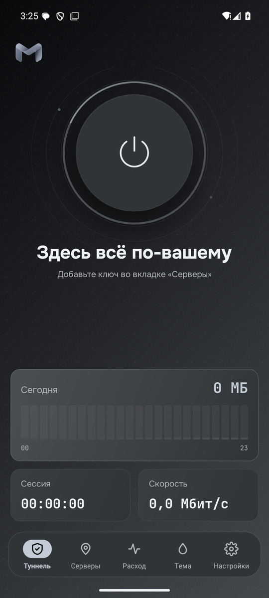
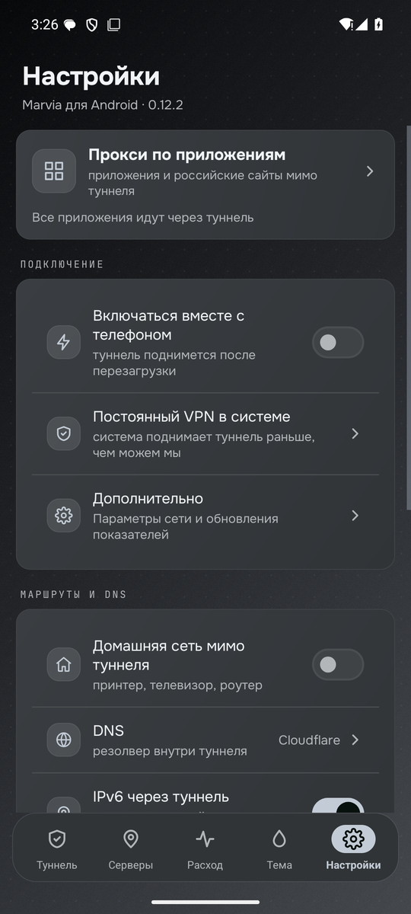
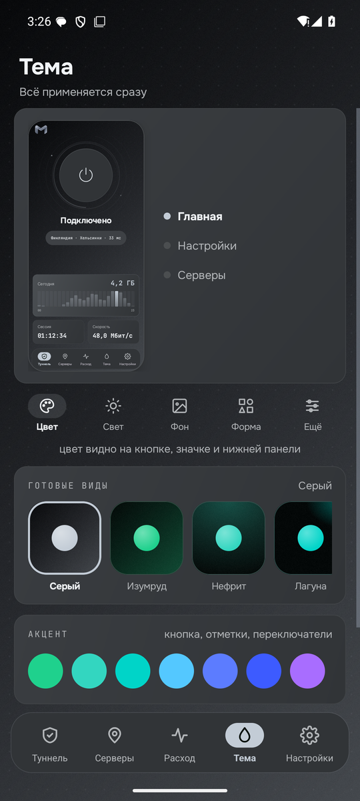
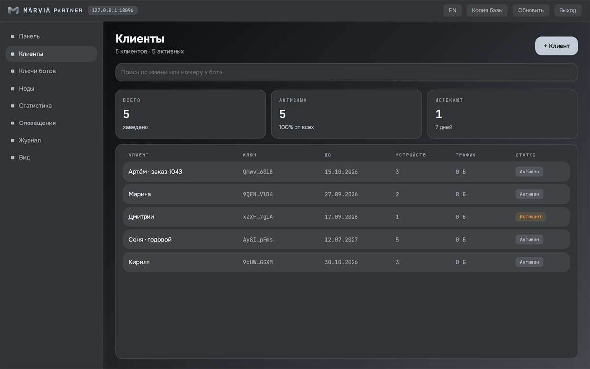
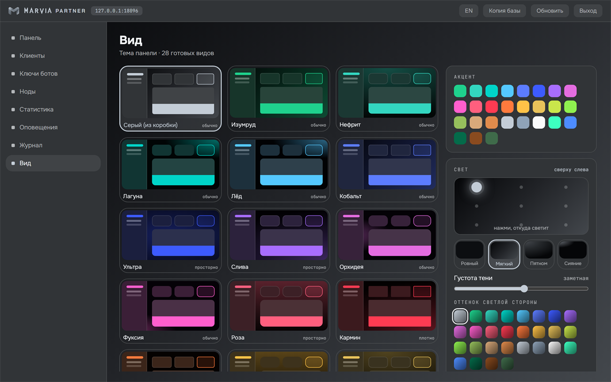
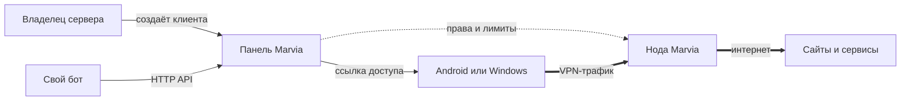
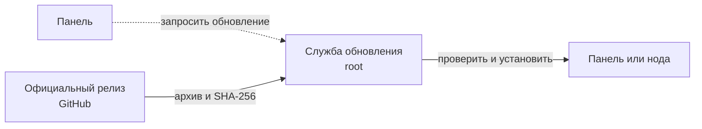

<div align="center">


# Marvia

### Подключение для человека. Своя инфраструктура для того, кто выдаёт доступ.

Android и Windows · панель и ноды Linux · VP1, VLESS и Trojan

[](https://github.com/jytt8u/marvia/releases/latest)
[](https://github.com/jytt8u/marvia/actions)
[](go.mod)

**[Скачать](https://github.com/jytt8u/marvia/releases/latest)** · **[Установить панель](#установка-панели)** · **[Документация](docs/guide.md)** · **[Что пока не готово](#что-пока-не-готово)**

</div>

---

Marvia связывает два привычных сценария. Покупатель получает ссылку, открывает
её в приложении и подключается. Владелец сервера разворачивает панель и ноды,
выдаёт доступ вручную или через своего бота и видит сроки, лимиты и расход.
Панель управляет доступом; VPN-трафик идёт **от приложения к ноде**.

## Посмотрите на приложение

Снимки сделаны с Android-приложения **0.12.2** на эмуляторе. Здесь пустой
профиль без ключей: настоящие адреса и данные покупателей в README не попадают.
Цифры в предпросмотре темы — макет.

<table>
<tr>
<td align="center" width="33%"><br><sub>Главная · состояние и расход</sub></td>
<td align="center" width="33%"><br><sub>Настройки · маршруты, DNS, VPN</sub></td>
<td align="center" width="33%"><br><sub>Тема · предпросмотр и акценты</sub></td>
</tr>
</table>

Панель для продавца — отдельное приложение на его сервере. Ниже демонстрационные
записи, созданные для снимков экрана:

<div align="center">
<br>
<sub>Клиенты: срок, устройства, трафик и статус</sub>
</div>

<details>
<summary>Ещё один экран: оформление панели</summary>
<br>

</details>

## Один доступ, две стороны



Приложение выбирает рабочую ноду и может перейти на другую, если текущая
перестала отвечать. Нода не хранит историю посещений. При краткой недоступности
панели она может запуститься с зашифрованным снимком прав доступа возрастом до
24 часов; явный отзыв токена и отключение ноды имеют приоритет.
[Подробнее об архитектуре и границах доверия](docs/architecture.md).

Обновление сервера отделено от веб-панели:



Панель не передаёт службе произвольный исполняемый файл. Служба скачивает
официальный релиз и проверяет его контрольную сумму до установки.

## Что здесь своё

| Для покупателя | Для владельца сервера |
|---|---|
| Приложения для Android и Windows с единым оформлением | Панель, ноды и API для собственного бота |
| Одна ссылка Marvia со списком доступных нод | Сроки, квоты, лимит устройств, статистика и резервные копии |
| На Android — также отдельные ключи и подписки VLESS, VMess, Trojan, Shadowsocks, Hysteria2 и WireGuard | VP1 рядом с VLESS и Trojan: можно обслуживать свои ключи и привычные Xray-клиенты |
| Маршруты по приложениям, DNS, IPv6, дробление TLS-приветствия, история сессий и темы | Проверяемые релизы и отдельная служба обновления с правами root |

VP1 использует Noise IK, X25519, ChaCha20-Poly1305 и BLAKE2s. Самодельных
криптопримитивов нет; [формат и модель угроз описаны отдельно](docs/protocol.md).

## Как Marvia выглядит рядом с другими панелями

Marvia — пока молодой **полный комплект**, где клиентские приложения развиваются
в одном проекте с панелью и нодой. Другие проекты сильнее в ряде задач продавца;
таблица помогает выбрать подходящий инструмент, а не объявляет победителя.

| Проект | Фокус | Клиентский путь | Сильные стороны сегодня |
|---|---|---|---|
| **Marvia** | Панель + ноды + Android/Windows + VP1 | Свои приложения и ссылка Marvia; Android принимает внешние ключи | Единый интерфейс покупателя и сервера; свой протокол вместе с VLESS/Trojan |
| [Marzban](https://github.com/Gozargah/Marzban) | Панель для Xray | Подписки для разных клиентов; есть отдельный [Nabzram](https://github.com/Gozargah/Nabzram) | Периодический сброс трафика, Telegram-бот, зрелая экосистема |
| [Remnawave](https://docs.rw/) | Панель и ноды Xray | Шаблоны для Mihomo, sing-box и других клиентов | Гибкие форматы подписок и контроль устройств |
| [3x-ui](https://docs.sanaei.dev/docs/) | Панель Xray | Подписки и конфигурации для разных клиентов | Много протоколов и инструментов администратора |

Сравнение опирается на документацию проектов, ссылки приведены в названиях.
Функции и форматы у них меняются; перед миграцией проверьте актуальный релиз.

## Начать пользоваться

### Если вам дали ключ

1. Скачайте [Android APK](https://github.com/jytt8u/marvia/releases/latest/download/marvia-android.apk)
   или [Windows-клиент](https://github.com/jytt8u/marvia/releases/latest/download/marvia-windows.exe).
   В Google Play приложение пока не опубликовано.
2. Откройте полученный ключ `marvia://…` во вкладке «Серверы».
3. Подключитесь на главном экране. Состояние, скорость, расход и историю сессий
   можно посмотреть в самом приложении.

Для Android подходят также отдельные ключи и подписки перечисленных выше
протоколов. [Руководство по клиенту](docs/guide.md#клиент-для-android).

### Установка панели

Понадобятся Linux-сервер и домен с A-записью на него. Скачайте установщик из
[официального релиза](https://github.com/jytt8u/marvia/releases/latest):

```bash
curl -fsSL https://github.com/jytt8u/marvia/releases/latest/download/install-panel.sh -o install-panel.sh
sh install-panel.sh --domain panel.example.com --email you@example.com
```

Установщик проверит контрольные суммы, настроит службу и сертификат. Админский
токен показывается один раз — сохраните его отдельно. Затем в панели:
**Ноды → + Нода** выдаст команду установки на другой сервер, а
**Клиенты → + Клиент** создаст первую ссылку. Для своего бота есть
[HTTP API](docs/bot.md). [Полная инструкция, требования и восстановление](docs/guide.md).

## Что пока не готово

- **Google Play.** Нужны физическая проверка актуальной сборки, политика
  конфиденциальности внутри приложения, декларации VPN и фоновой службы,
  тестовый доступ для проверки и тестирование в Play Console.
  [План публикации](docs/google-play.md).
- **Для продавцов.** Нет автоматического ежемесячного сброса квоты и импорта
  покупателей из чужих панелей с сохранением ссылок.
- **Форматы и платформы.** Нет iOS-клиента, форматов подписок Clash и sing-box,
  TUIC и плагинов Shadowsocks. Несколько устройств с общим ключом нельзя
  отозвать по отдельности.
- **До версии 1.0.** Нужно стабилизировать API бота и форматы ссылок, проверить
  установку и откат на чистых серверах и добавить поэтапное обновление нод.

Версия ниже 1.0 означает, что API и форматы ещё могут меняться. Marvia не
предоставляет хостинг нод и не принимает платежи: серверы и бот принадлежат
тому, кто выдаёт доступ.

## Документация и сборка

| Документ | Содержание |
|---|---|
| [Руководство](docs/guide.md) | установка, эксплуатация, клиенты и сборка |
| [Публикация в Google Play](docs/google-play.md) | AAB, ключ подписи и Play Console |
| [Архитектура](docs/architecture.md) | панель, ноды, клиенты и безопасность |
| [Протокол VP1](docs/protocol.md) | хендшейк, кадры, маскировка и ограничения |
| [API для бота](docs/bot.md) | выдача и управление доступом |
| [Конфиденциальность](docs/privacy.md) | данные на устройстве и сервере |
| [История изменений](CHANGELOG.md) | изменения по версиям |

Для серверных бинарников нужен Go 1.26.6+:

```bash
go test ./...
go build -o bin/ ./...
```

Android собирается отдельно. Подписанные APK и AAB создаёт
[`scripts/publish-apk.ps1`](scripts/publish-apk.ps1); ключ подписи хранится вне
репозитория. [Инструкция по сборке](docs/guide.md#сборка-версия-и-подпись).
