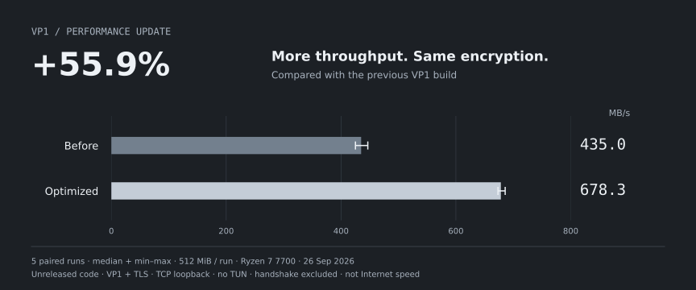

<div align="center">


**VPN для Android и Windows. Панель, ноды и протокол VP1.**

[Русский](README.md) · [English](README.en.md) · [简体中文](README.zh-CN.md)

[](https://github.com/jytt8u/marvia/releases/latest/download/marvia-android.apk)
[](https://github.com/jytt8u/marvia/releases/latest/download/marvia-windows.exe)
[](#установка-панели)
[](docs/guide.md)

[Releases](https://github.com/jytt8u/marvia/releases) · [CI](https://github.com/jytt8u/marvia/actions) · [Privacy](docs/privacy.md)

</div>

## Приложение

Android 0.12.2 · реальные снимки эмулятора · без добавленного ключа

| Главная | Настройки VPN | Сеть и приватность |
|:---:|:---:|:---:|
|  |  |  |

<details>
<summary>Windows и панель — сохранённые снимки</summary>

Windows 0.9.3 и локальный стенд панели. Android выше — актуальный релиз 0.12.2.


</details>

## Архитектура


Панель управляет доступом; пакеты идут через ноду без панели.
[Границы доверия](docs/architecture.md).

## VP1 стал быстрее



**+56% к прежней версии VP1.** Меньше лишних записей TLS; шифрование и совместимость сохранены. Оптимизация готовится к следующему релизу.

Пять парных прогонов по 512 МиБ на одном ПК, без интернета и TUN.
Это прирост локальной пропускной способности, не обещание ускорить интернет на 56%.

[До и после: данные](docs/benchmarks/2026-09-26-record-fit/README.md) ·
[Полное сравнение с VLESS и Trojan](docs/performance.md) · [Код теста](cmd/marvia-bench)
В полном локальном сравнении VLESS и Trojan пока быстрее VP1.

## Протоколы

WireGuard и OpenVPN передают IP-пакеты; остальные строки — прокси. На Android
Marvia создаёт системный VPN-интерфейс и для сторонних прокси-ключей.

| Протокол | Транспорт и отличие | Поддержка Marvia |
|---|---|---|
| **[VP1](docs/protocol.md)** | Noise-прокси поверх TLS/REALITY, WebSocket или QUIC; QUIC при недоступном UDP переходит на TCP | Своя нода, Android и Windows |
| [WireGuard](https://www.wireguard.com/protocol/) | IP-туннель через UDP; штатной маскировки под HTTPS нет | Android: сторонний ключ |
| [OpenVPN](https://openvpn.net/community-docs/community-articles/openvpn-2-7-manual.html) | IP-туннель через UDP или TCP с TLS; это отдельный протокол, а не обычный HTTPS | Не встроен |
| [VLESS + REALITY](https://xtls.github.io/en/config/transports/reality.html) | Прокси через TCP с маскировкой TLS под целевой сайт | Нода и Android |
| [Trojan](https://github.com/trojan-gfw/trojan/blob/master/docs/protocol.md) | Прокси внутри TLS с сайтом-прикрытием | Нода и Android |
| [Shadowsocks](https://shadowsocks.org/doc/what-is-shadowsocks.html) | Шифрованный TCP/UDP-прокси; сам по себе не выглядит как HTTPS | Android: сторонний ключ |
| [Hysteria 2](https://v2.hysteria.network/docs/developers/Protocol/) | Прокси через QUIC/UDP с видом HTTP/3; требуется доступный UDP | Android: сторонний ключ |

WireGuard, OpenVPN, Hysteria 2 и Xray в этом бенчмарке не запускались.
VP1 не совместим с клиентами WireGuard или Xray.

## Что внутри

| Клиент | Сервер |
|---|---|
| Android: свои и чужие ключи, выбор ноды, статистика, настройки VPN | Панель и ноды: лимиты, учёт, резервные копии, API бота |
| Windows: TUN-клиент | VP1, VLESS и Trojan; проверяемое обновление нод |

## Чем отличается от других

| Проект | Основной фокус | Сильная сторона |
|---|---|---|
| **Marvia** | Панель + ноды + свои Android/Windows + VP1 | один комплект для покупателя и владельца |
| [Marzban](https://github.com/Gozargah/Marzban) | Xray-панель | периодические квоты, Telegram-бот; есть отдельный [Nabzram](https://github.com/Gozargah/Nabzram) |
| [Remnawave](https://docs.rw/) | Xray-панель и ноды | шаблоны Mihomo/sing-box, контроль устройств |
| [3x-ui](https://docs.sanaei.dev/docs/) | Xray-панель | широкий выбор протоколов и админ-инструментов |

Marvia пока уступает по автоматическому месячному сбросу квот, импорту клиентов
и форматам Clash/sing-box. Сравнение основано на документации проектов по
ссылкам в таблице; сравнимых замеров скорости конкурентов пока нет.

## Начать

> **Получили ключ?** Скачайте [Android APK](https://github.com/jytt8u/marvia/releases/latest/download/marvia-android.apk)
> или [Windows-клиент](https://github.com/jytt8u/marvia/releases/latest/download/marvia-windows.exe),
> добавьте ссылку `marvia://…` во вкладке «Серверы» и подключитесь.

Android также принимает VLESS, VMess, Trojan, Shadowsocks, Hysteria2 и WireGuard.
В Google Play приложения пока нет.

### Установка панели

Нужны Linux-сервер и домен с A-записью. Установщик берётся из
[официального релиза](https://github.com/jytt8u/marvia/releases/latest):

```bash
curl -fsSL https://github.com/jytt8u/marvia/releases/latest/download/install-panel.sh -o install-panel.sh
sh install-panel.sh --domain panel.example.com --email you@example.com
```

Сохраните показанный при установке админский токен. Затем создайте ноду и
клиента в панели. [Полный порядок](docs/guide.md) · [API бота](docs/bot.md).

## Что пока не готово

- Google Play: проверка новой сборки на телефоне, декларации и тестирование. [План публикации](docs/google-play.md).
- Автоматический месячный сброс квоты и импорт покупателей с сохранением ссылок.
- iOS, подписки Clash/sing-box, TUIC, плагины Shadowsocks и раздельный отзыв
  устройств с общим ключом.
- До 1.0: стабилизация API и ссылок, проверка отката и поэтапное обновление нод.

Marvia не продаёт доступ, не принимает платежи и не размещает серверы.
Версия ниже 1.0 означает, что API и форматы могут меняться.

## Документы и сборка

[Руководство](docs/guide.md) ·
[Архитектура](docs/architecture.md) ·
[Протокол VP1](docs/protocol.md) ·
[Конфиденциальность](docs/privacy.md) ·
[История версий](CHANGELOG.md)

Для серверных бинарников нужен Go 1.26.6+:

```bash
go test ./...
go vet ./...
go build -o bin/ ./...
```

Android собирается отдельно через [`scripts/publish-apk.ps1`](scripts/publish-apk.ps1);
ключ подписи хранится вне репозитория.
