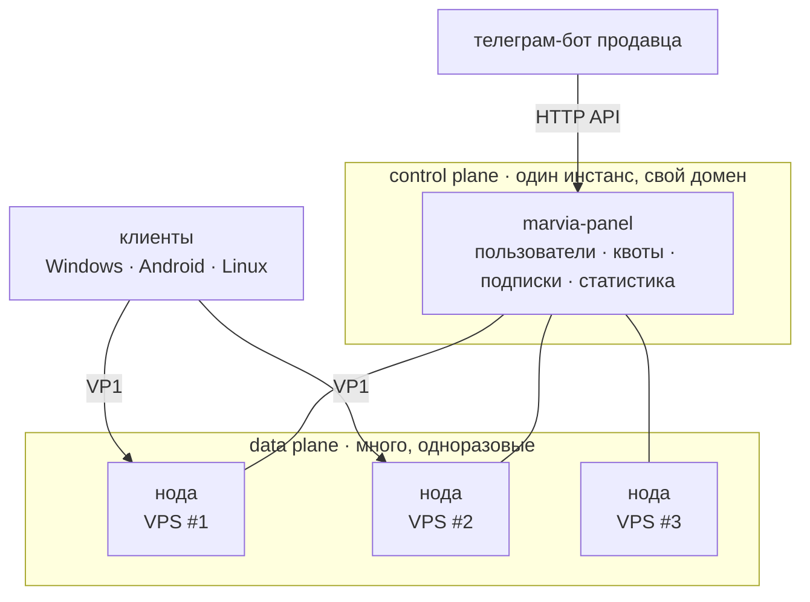

# Marvia

**Инфраструктура для тех, кто раздаёт доступ.** Свой протокол, ноды, панель
управления и клиенты — одной системой, а не связкой из четырёх чужих проектов.


---

## Кому это

Не конечному пользователю. **Тому, кто продаёт или раздаёт доступ**: владельцу
телеграм-бота, мелкому провайдеру, админу, раздающему знакомым.

Сегодня его обслуживает связка «Xray + Marzban или 3x-ui + чужие клиенты», и у
неё вполне конкретные болячки:

| Боль | Что с этим делает Marvia |
|---|---|
| Ноду заблокировали, надо срочно поднимать новую | установка одной командой, автоматическая ротация в подписках |
| Клиенты у всех чужие и одинаковые | свой клиент, который можно отдать под своим именем |
| Учёт трафика приблизительный, лимиты обходятся | учёт по криптографической идентичности, а не по строке из конфига |
| Пользователь не понимает, почему «не работает» | клиент сам меряет ноды и переключается, не спрашивая человека |
| Интеграция с ботом — самописные костыли | HTTP API как первоклассная часть системы |

---

## Быстрый старт

Нужен чистый сервер с Linux и домен, нацеленный на него A-записью.

**1. Панель**

```bash
curl -fsSL https://github.com/jytt8u/marvia/releases/latest/download/install-panel.sh -o install-panel.sh
sh install-panel.sh --domain panel.example.com --email you@example.com
```

Компилятор не нужен. Скрипт сам определит разрядность, скачает ядро, сверит
контрольную сумму, поставит службу и **получит сертификат Let's Encrypt**. В
конце напечатает админский токен — один раз.

**2. Нода**

Открыть панель → **Ноды** → **+ Нода**. Панель выдаст готовую строку:

```bash
curl -fsSL https://panel.example.com/install/<приглашение> | sh
```

Вставить её на чистом сервере. Всё: ключи выпущены, нода записана в панель,
служба поднята и проверена. Ни одного флага, ни одного файла для правки.
Скачивать для ноды ничего не надо — бинарник она берёт у самой панели.

**3. Первый покупатель**

**Клиенты** → **+ Клиент** → срок, лимит, виды доступа. Панель сразу покажет
ссылку, которую надо переслать человеку.

Дальше можно выпустить ключ для бота (**Ключи ботов**) — и продавать он будет
сам, без захода в панель на каждую оплату.

---

## Чем отличается

| | Marzban · 3x-ui · Remnawave | Marvia |
|---|---|---|
| Установка панели | установка, затем настройка обратного прокси руками | одна строка, сертификат берёт сама |
| Добавление ноды | отдельная установка, копирование конфига | строка из панели, бинарник берёт у неё же |
| Идентификация пользователя | UUID внутри запроса — по сути bearer-токен | публичный ключ как побочный результат расшифровки, O(1) |
| Ответ на активное зондирование | зависит от настройки | настоящий чужой сайт с его подлинным сертификатом |
| Клиенты | любые стоковые | **свои; чужие наш протокол не понимают** |
| Зрелость | годы, тысячи установок | **месяцы, единицы** |

Последние две строки — слабые места, и мы называем их сами. Нода при этом
двуязычная: рядом с нашим протоколом она говорит на VLESS и Trojan, поэтому
переехать на панель можно, не трогая текущих покупателей — у них останется
привычное приложение и та же ссылка.

---

## Как устроено



Нода — расходник. Её блокируют, изымают, она уезжает вместе с хостером.
Поэтому она не знает ничего лишнего: **у неё нет базы пользователей**, она не
знает о существовании других нод, не пишет в журнал, кто куда ходил, и,
потеряв связь с панелью, **продолжает работать** по последнему известному
состоянию, а не роняет всех клиентов.

---

## Протокол VP1

Noise Protocol Framework, паттерн `IK`. Ровно тот набор примитивов, что у
WireGuard:

| Роль | Выбор |
|---|---|
| Обмен ключами | X25519 |
| Шифр | ChaCha20-Poly1305 |
| Хеш | BLAKE2s |

**Своих криптопримитивов в проекте нет и не будет.** Единственное, что мы
конструируем сами, — то, как это выглядит на проводе.

Что из этого следует:

- **Секрет пользователя никогда не уходит в сеть.** Скомпрометированная нода
  выдаёт список публичных ключей — по ним нельзя выдать себя за пользователя
  на другой ноде.
- **Один round-trip** до первого байта данных, взаимная аутентификация,
  forward secrecy.
- **Не зная публичного ключа сервера, разговор начать нельзя в принципе.**

Снаружи это обычный HTTPS: ClientHello с отпечатком Chrome через uTLS, а на
ноде — REALITY, то есть чужой настоящий сайт отдаёт свой подлинный сертификат
и свой ServerHello. Сканер, пришедший на ноду, получает этот сайт, а не нас.
Размеры кадров размыты добивкой, чтобы вложенный TLS не просвечивал сквозь
наш.

Подробно и с честным списком того, чего нет, — [docs/protocol.md](docs/protocol.md).

---

## Что уже работает

| | |
|---|---|
| Протокол, туннель, аутентификация | ✅ |
| Камуфляж: uTLS, сайт-прикрытие, мультиплексирование, добивка | ✅ |
| Многопользовательский режим: квоты, учёт, лимит устройств | ✅ |
| Панель: API, веб-интерфейс, подписки, статистика по нодам | ✅ |
| VLESS и Trojan рядом с VP1 на той же ноде | ✅ |
| REALITY на ноде и в нашем клиенте | ✅ |
| Транспорт за CDN: адрес ноды не попадает в конфиги | ✅ |
| Клиент Windows с TUN и окном | ✅ |
| Клиент Android: VpnService и экран подключения | ✅ |
| Установка ноды и панели одной командой, ACME | ✅ |

Замер на живом: **225 Мбит/с** сквозь туннель из России до ноды в Финляндии
(08.09.2026). Тринадцать запросов браузера прошли через **одно** TCP-соединение
до ноды.

**Чего пока нет:** iOS, UDP и QUIC как транспорт, оповещений продавцу, журнала
событий, интерфейса на других языках. Версия начинается с нуля осознанно: до
1.0 API и форматы могут меняться.

Что доделывается и в каком порядке — [docs/release-plan.md](docs/release-plan.md).

---

## Панель

Один бинарник, база — SQLite, страница вшита внутрь вместе со шрифтами: панель
для обхода блокировок, которая не открывается без зарубежного CDN, — это
издевательство, а каждое такое открытие ещё и сообщало бы стороннему хосту,
что её открыли и откуда.

Что в ней делается нажатием: клиенты (завести, продлить, отключить, отозвать
доступ, выдать второй), ноды (пригласить, назвать, выключить, удалить), ключи
для ботов, статистика за 30 дней по дням и по нодам, копия базы, раздача
приложений покупателям, 27 тем оформления.

Разделов, за которыми нет данных, в ней нет: **нарисованная кнопка — это
обещание**.

---

## Документация

| | |
|---|---|
| [docs/guide.md](docs/guide.md) | установка, эксплуатация, API, отладка |
| [docs/architecture.md](docs/architecture.md) | на чём всё держится и почему устроено так |
| [docs/protocol.md](docs/protocol.md) | VP1: хендшейк, кадры, добивка, что видно снаружи |
| [docs/bot.md](docs/bot.md) | справочник для автора телеграм-бота |
| [docs/release-plan.md](docs/release-plan.md) | что доделать и в каком порядке публиковать |

## Сборка из исходников

Нужен Go 1.26+.

```bash
go build -o bin/ ./...
```

```bash
go test ./...
```

Для Linux-ноды из-под Windows:

```bash
GOOS=linux GOARCH=amd64 go build -o bin/linux/ ./...
```

---

## Чего мы не делаем и почему

**Панель на телефоне.** Телефон покупателя — чтобы подключаться, а не
управлять. Аварийные действия на маленьком экране одной рукой ночью стоят
дороже, чем польза от них.

**Свой платёжный шлюз.** Это чужой бизнес с лицензиями и ответственностью.
Наше дело — чтобы бот продавца получил доступ за один запрос, а деньги он
собирает как умеет.

**Хостинг нод за продавца.** Тогда мы перестаём быть инструментом и
становимся VPN-провайдером — со всей ответственностью за чужой трафик и с
единой точкой, которую достаточно заблокировать один раз.

---

## Правовая заметка

Разработка и личное использование средств обхода блокировок в России не
криминализованы, но с 2024 года действуют штрафы за рекламу и популяризацию
таких инструментов. Это стоит учитывать при публичном позиционировании — на
саму разработку не влияет.
