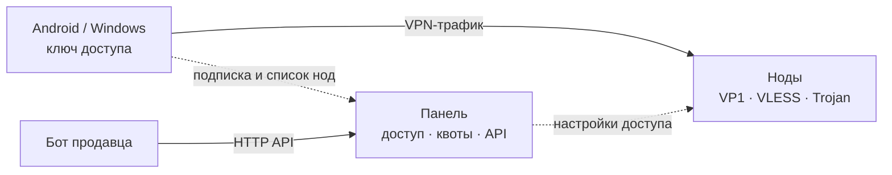

<div align="center">


# Marvia

**Клиенты, ноды и панель для одной VPN-системы.**

Свой протокол VP1 рядом с VLESS и Trojan. Приложения для Android и Windows;
панель и ноды работают на Linux.

[](https://github.com/jytt8u/marvia/releases/latest)
[](go.mod)
[](https://github.com/jytt8u/marvia/actions)

[**Скачать приложения**](https://github.com/jytt8u/marvia/releases/latest) ·
[**Установить панель**](#установка-для-продавца) ·
[**Руководство**](docs/guide.md) ·
[**Что ещё предстоит**](#что-ещё-предстоит)

</div>

---

Marvia рассчитана на две стороны одного подключения. **Покупатель** получает
ссылку доступа, подключается с телефона или компьютера и видит состояние
туннеля. **Продавец** запускает свою панель и ноды, выдаёт доступ вручную или
через собственного бота и управляет сроками и лимитами через API.

<div align="center">
  
  <br>
  <sub>Панель: клиенты, сроки, устройства и расход. Демонстрационные данные.</sub>
</div>

## Если вам дали доступ

1. Установите приложение для [Android](https://github.com/jytt8u/marvia/releases/latest/download/marvia-android.apk)
   или [Windows](https://github.com/jytt8u/marvia/releases/latest/download/marvia-windows.exe).
   Продавец может дать ссылку на ту же сборку со своего домена. В Google Play
   приложение пока не опубликовано.
2. Откройте полученный ключ `marvia://…` в приложении.
3. Нажмите кнопку подключения. Приложение проверит доступные ноды и выберет
   рабочую; при потере соединения попробует другую.

Android-клиент также принимает отдельные ключи и подписки VLESS, VMess,
Trojan, Shadowsocks, Hysteria2 и WireGuard. Для обхода туннеля можно выбрать
приложения, локальную сеть и российские маршруты; это **настройки**, а не
обязательное поведение для всех. Есть выбор DNS, IPv6, дробления TLS-приветствия,
частоты проверок, истории сессий и оформления. Подробности — в
[руководстве по клиенту](docs/guide.md#клиент-для-android).

## Установка для продавца

Понадобятся сервер Linux и домен с A-записью на его адрес. Панель ставится из
[официального релиза](https://github.com/jytt8u/marvia/releases/latest):

```bash
curl -fsSL https://github.com/jytt8u/marvia/releases/latest/download/install-panel.sh -o install-panel.sh
sh install-panel.sh --domain panel.example.com --email you@example.com
```

Установщик подберёт архитектуру, проверит контрольные суммы, настроит службу
и сертификат. Админский токен он покажет один раз — сохраните его отдельно.

Дальше в панели: **Ноды → + Нода** выдаст команду установки для второго
сервера; **Клиенты → + Клиент** выдаст первую ссылку доступа. Для собственного
бота есть [HTTP API](docs/bot.md). Полный порядок, требования к серверу и
резервному копированию — в [руководстве](docs/guide.md).

## Как части связаны



Нода не хранит историю посещений. Если панель временно недоступна, нода может
запуститься по зашифрованному снимку доступа, которому не больше 24 часов;
отзыв токена и отключение ноды имеют приоритет. Как устроены границы доверия,
учёт трафика и восстановление — в [архитектуре](docs/architecture.md).

## Что уже работает

| Область | Сейчас |
|---|---|
| Android | VPN, несколько подписок, замер и смена нод, расход, история сессий, настройки маршрутов и DNS, темы |
| Windows | TUN для трафика компьютера, выбор ноды, журнал, трей, те же темы |
| Панель | пользователи, сроки, квоты, лимит устройств, API, статистика, оповещения и резервные копии |
| Ноды | VP1, VLESS и Trojan, маскировка, CDN-транспорт, аварийный запуск без панели до 24 часов |
| Обновления | релизы с контрольными суммами и аттестацией; панель и ноды обновляются отдельной службой |

Протокол VP1 использует Noise IK, X25519, ChaCha20-Poly1305 и BLAKE2s. Своих
криптопримитивов здесь нет. [Формат и модель угроз](docs/protocol.md) описаны
отдельно.

## Что ещё предстоит

- **Перед Google Play:** физическая проверка последнего Android-релиза,
  публичная политика конфиденциальности внутри приложения, декларации VPN и
  фоновой службы, тестовый доступ для проверки и тестирование в Play Console.
  [Пошаговая подготовка](docs/google-play.md).
- **Для продавцов:** автоматический ежемесячный сброс квоты и перенос клиентов
  из других панелей с сохранением их ссылок.
- **До 1.0:** стабилизировать API бота и форматы ссылок, проверить установку и
  откат на чистых серверах, добавить поэтапное обновление нод.

Пока нет клиента для iOS, форматов подписок Clash и sing-box, TUIC и плагинов
Shadowsocks. У нескольких устройств с общим ключом нет раздельного отзыва.
Версия ниже 1.0 означает, что API и форматы ещё могут меняться.

## Документы и сборка

| Документ | О чём он |
|---|---|
| [Руководство](docs/guide.md) | установка, эксплуатация и клиенты |
| [Публикация в Google Play](docs/google-play.md) | готовый AAB, ключ подписи и шаги в консоли |
| [Архитектура](docs/architecture.md) | устройство панели, нод и клиентов |
| [Протокол VP1](docs/protocol.md) | хендшейк, кадры, маскировка и ограничения |
| [API для бота](docs/bot.md) | выдача и управление доступом |
| [Конфиденциальность](docs/privacy.md) | что хранится на устройстве и у владельца сервера |
| [История изменений](CHANGELOG.md) | изменения по версиям |

Для серверных бинарников нужен Go 1.26.6+:

```bash
go test ./...
go build -o bin/ ./...
```

Android собирается отдельно; подписанный APK и AAB создаёт
[`scripts/publish-apk.ps1`](scripts/publish-apk.ps1). Ключ подписи хранится вне
репозитория. [Инструкции по сборке](docs/guide.md#сборка-версия-и-подпись).

## Границы проекта

Marvia не предоставляет хостинг нод, не принимает платежи и не превращает
телефон покупателя в панель управления. Серверы и бот принадлежат тому, кто
выдаёт доступ; Marvia даёт ему программные части, а покупателю — клиент.
