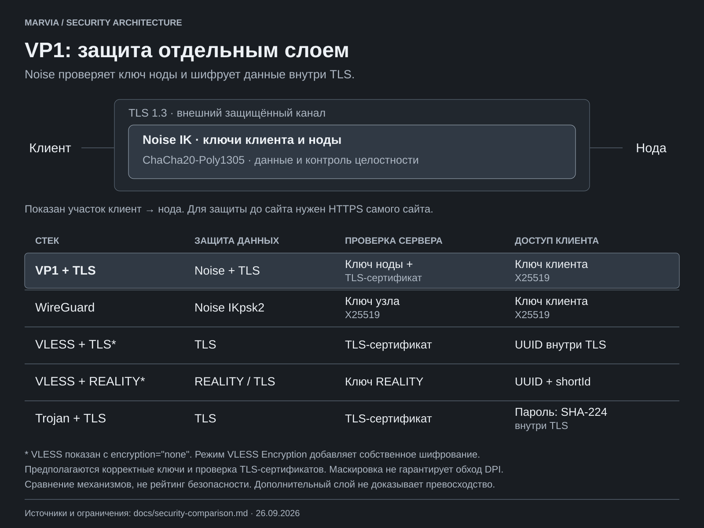

# Защита протоколов: механизмы и границы

26 сентября 2026. Сравниваются указанные конфигурации, а не все режимы каждого
проекта. Это обзор исходников и документации, не независимый аудит и не
доказательство, что один протокол безопаснее остальных.

## Что выделяет VP1

VP1 устанавливает Noise IK внутри транспортного соединения. Клиент заранее
знает публичный ключ ноды; нода проверяет ключ клиента по списку доступа.
Полезные данные защищены ChaCha20-Poly1305, отдельно от внешнего TLS.
Это дополнительная граница проверки ключей, а не «вдвое больше безопасности».

**Практический смысл, вывод из архитектуры:** если раскрыт только внешний
TLS-канал, содержимое VP1 остаётся шифротекстом Noise. Это требует подлинного
ключа ноды у клиента и сохранности ключей и реализации Noise. Захват самой
ноды или телефона может раскрыть оба слоя; от этого вложенное шифрование
не защищает. Защита заканчивается на ноде — для содержимого до конечного
сайта нужен HTTPS самого сайта.

Подтверждение в коде: [набор шифров](../internal/vp1/keys.go),
[PeerStatic и взаимный хендшейк](../internal/vp1/handshake.go),
[проверка разрешённых клиентов](../cmd/marvia-node/serve.go),
[AEAD и разрыв при повреждении кадра](../internal/vp1/conn.go).

## Сравнение конфигураций

### Где есть преимущество в конкретном сценарии

| Сценарий | VP1 | С чем сравниваем и где граница |
|---|---|---|
| Прочитана только копия списка доступа | **0 закрытых ключей клиентов** в записях VP1; публичный ключ не позволяет войти | В реализации Marvia VLESS хранит UUID, Trojan — пароль. Это пригодные для входа секреты. У WireGuard тоже публичные ключи, здесь превосходства над ним нет |
| Подменён только внешний TLS-сервер с доверенным сертификатом | Для завершения Noise всё равно нужен ключ настоящей ноды | Преимущество относительно TLS-режимов без дополнительной проверки ключа/пиннинга. REALITY и WireGuard тоже используют заранее заданные ключи |
| Раскрыты только ключи внешнего TLS-сеанса | Внутренний поток остаётся защищён Noise | Сравнение с обычными VLESS + TLS без Encryption и Trojan + TLS; собственный HTTPS приложения учитывается отдельно |

Первый вывод подтверждён [тестом списка доступа](../internal/panel/credential_security_test.go)
и [отказом входа с одним публичным ключом](../internal/vp1/credential_security_test.go).
Хранение учётных данных: [генерация в панели](../internal/panel/credentials.go)
и [идентичности на ноде](../internal/users/credentials.go).
Два остальных вывода относятся к архитектуре и требуют сохранности Noise
и подлинности исходного ключа ноды; это не результаты внешнего пентеста.

Копия списка доступа — не захват сервера или всей базы панели. Администратор
с правом менять список может разрешить свой ключ, а в других таблицах могут
находиться управляющие токены. Панель также видит закрытый ключ в момент
выдачи пользователю. Поэтому «утечка любых данных панели безопасна» — неверно.

[Результаты автоматической проверки и порядок независимого аудита](security-checks/2026-09-26/README.md).
[Постоянные проверки CI и сценарии атак](security-checks/README.md).

### Механизмы в выбранных конфигурациях

| Стек | Защита данных | Проверка сервера | Доступ клиента |
|---|---|---|---|
| **VP1 + TLS** | Noise + TLS | Заранее известный ключ ноды и TLS-сертификат | Владение закрытым ключом клиента; список разрешённых ключей |
| WireGuard | Noise IKpsk2, ChaCha20-Poly1305 | Заранее известный ключ узла | Владение закрытым ключом клиента; настройка peers |
| VLESS + TLS, `encryption=none` | TLS | TLS-сертификат | UUID внутри защищённого канала |
| VLESS + REALITY, `encryption=none` | REALITY на основе TLS | Ключ REALITY | UUID и shortId REALITY |
| Trojan + TLS | TLS | TLS-сертификат | SHA-224 пароля внутри TLS; это не отдельное шифрование данных |

В строках TLS предполагается проверка сертификата и имени сервера; везде —
подлинные конфигурации и секреты. У VLESS есть отдельный **VLESS Encryption**:
современная документация описывает гибридный `mlkem768x25519plus`. Поэтому
утверждение «VLESS вообще не шифрует» неверно. Эта опция не включена в две
конфигурации таблицы и не измерялась нашим бенчмарком.

Источники: [WireGuard: протокол и криптография](https://www.wireguard.com/protocol/),
[VLESS: UUID и Encryption](https://xtls.github.io/en/config/outbounds/vless.html),
[REALITY: ключи и shortId](https://xtls.github.io/en/config/transports/reality.html),
[слои защиты Xray](https://xtls.github.io/en/config/transport.html),
[Trojan: формат и TLS](https://trojan-gfw.github.io/trojan/protocol).

## Повторы и прошлые сессии

- **VP1:** метка времени и память принятых первых сообщений в пределах окна
  ±2 минуты. Память повторов хранится в процессе и теряется при перезапуске;
  это не гарантия отклонить старый хендшейк после рестарта внутри окна.
  Кадры используют последовательные nonce и AEAD. См. [ReplayGuard](../internal/vp1/replay.go).
- **WireGuard:** метки времени хендшейков, счётчики и окно повторов для UDP;
  предусмотрена регулярная смена ключей. Это собственная схема WireGuard,
  не идентичная ReplayGuard VP1. [Спецификация](https://www.wireguard.com/protocol/).
- **TLS-стеки:** защита записей зависит от версии и режима TLS. Для сравнения
  предполагается TLS 1.3 с эфемерным обменом и без 0-RTT; у 0-RTT другие
  свойства защиты от повторов. [RFC 8446, приложение E.5](https://www.rfc-editor.org/rfc/rfc8446#appendix-E.5).

Noise IK использует эфемерные ключи для прямой секретности транспортных данных.
Для отправляемых сервером данных есть оговорка: до получения первого
транспортного сообщения клиента спецификация гарантирует только слабую
прямую секретность, после — сильную, при указанных в спецификации условиях.
Первое сообщение хендшейка защищено иначе: у VP1 оно содержит время,
а не адрес назначения.
Свойства шаблона описаны в [Noise Framework](https://noiseprotocol.org/noise.html);
они не заменяют проверку всей реализации Marvia.

## Маскировка и пределы выводов

У VP1 есть [uTLS](../internal/transport/tls.go), [добивка](../internal/vp1/padding.go)
и [сайт-прикрытие](../cmd/marvia-node/serve.go). Trojan использует TLS и fallback;
REALITY отдельно меняет вид рукопожатия. WireGuard работает поверх UDP и сам
по себе не изображает HTTPS. Это разные решения для внешнего вида трафика,
а не шкала стойкости шифрования. Из наличия этих механизмов нельзя вывести,
что VP1 реже блокируется: для этого нужны сопоставимые сетевые испытания.

В репозитории нет отчёта независимого криптографического аудита VP1.
Тесты неправильного ключа сервера, отказа чужому клиенту, повторов и подмены
кадров находятся в [vp1_test.go](../internal/vp1/vp1_test.go), но тесты не
доказывают отсутствие всех уязвимостей. Более низкая скорость также не
доказывает более высокую безопасность.

Схема воспроизводится командой `python scripts/draw-security-comparison.py`.
